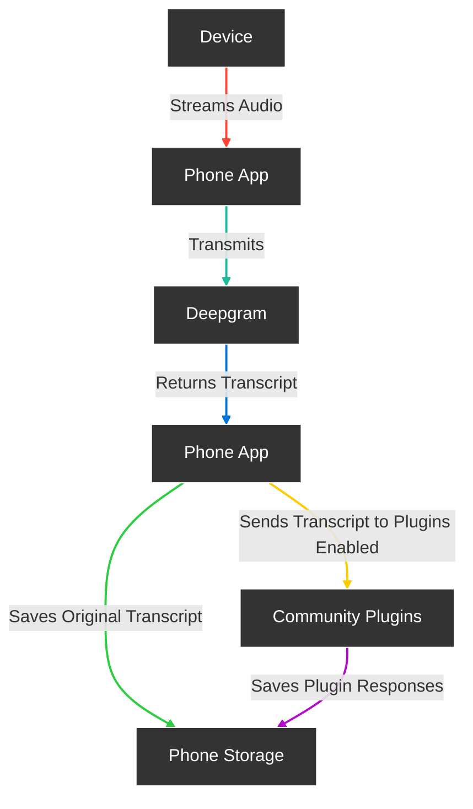

<div align="center">

# **ARVI**

Meet Arvi, the world’s leading open-source AI wearable that revolutionizes how you capture and manage conversations. Simply connect Friend to your mobile device and enjoy automatic, high-quality transcriptions of meetings, chats, and voice memos wherever you are.


[](https://opensource.org/licenses/MIT)&ensp;&ensp;&ensp;


</div>

## Features

- **Real-Time AI Audio Processing**: Leverage powerful on-device AI capabilities for real-time audio analysis.
- **Low-powered Bluetooth**: Capture audio for 24h+ on a small button battery
- **Open-Source Software**: Access and contribute to the pin's software stack, designed with openness and community collaboration in mind.
- **Wearable Design**: Experience unparalleled convenience with ergonomic and lightweight design, perfect for everyday wear.

## Get Started with our Documentation:


## Contribution:


## How it works



## Get the software


Or you can build your own app from the sources in `apps/AppWithWearable` and firmware from `firmware` folders.


# Getting Started

Follow these steps to get started with your Friend.

### Install the app

Before starting, make sure you have the following installed:

- Flutter SDK
- Dart SDK
- Xcode (for iOS)
- Android Studio (for Android)
- CocoaPods (for iOS dependencies)

### Setup Instructions

1. **Upgrade Flutter**:
   Before proceeding, make sure your Flutter SDK is up to date:
    ```
    flutter upgrade
    ```

2. **Get Flutter Dependencies**:
   From within `apps/AppWithWearable`, install flutter packages:
    ```
    flutter pub get
    ```

3. **Install iOS Pods**:
   Navigate to the iOS directory and install the CocoaPods dependencies:
    ```
    cd ios
    pod install
    pod repo update
    ```

4. **Environment Configuration**:
   Create `.env` using template `.env.template`
    ```
    cd ..
    cat .env.template > .env
    ```

5. **API Keys**:
   Add your API keys to the `.env` file. (Sentry is not needed)

6. **Run Build Runner**:
   Generate necessary files with Build Runner:
    ```
    dart run build_runner build
    ```

7. **Run the App**:
    - Select your target device in Xcode or Android Studio.
    - Run the app.


## Licensing

Arvi is available under MIT License
